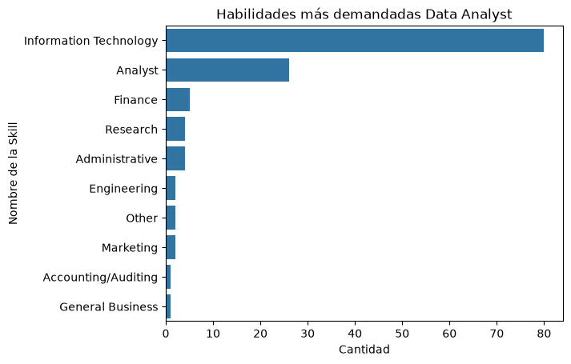
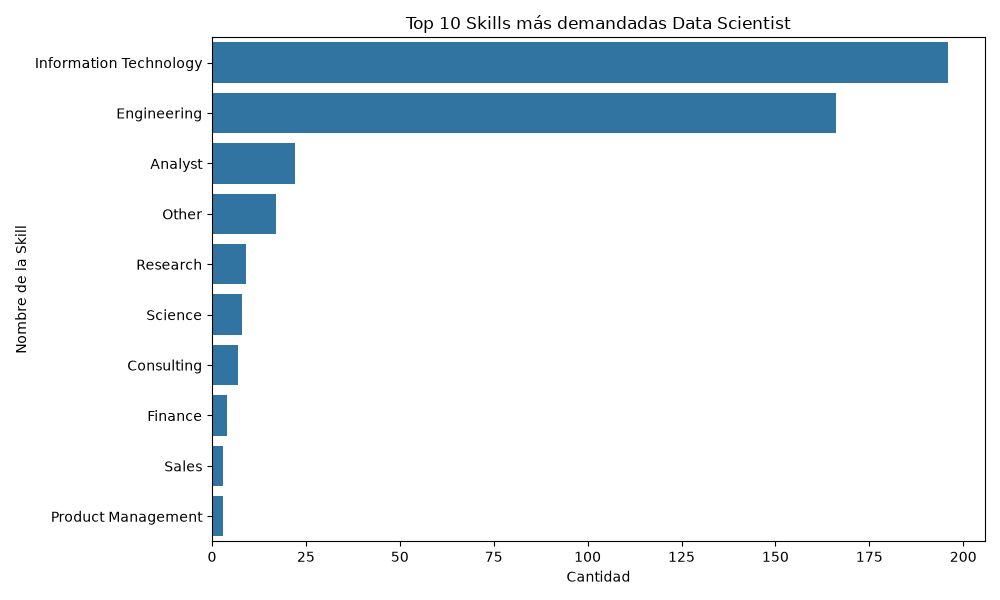
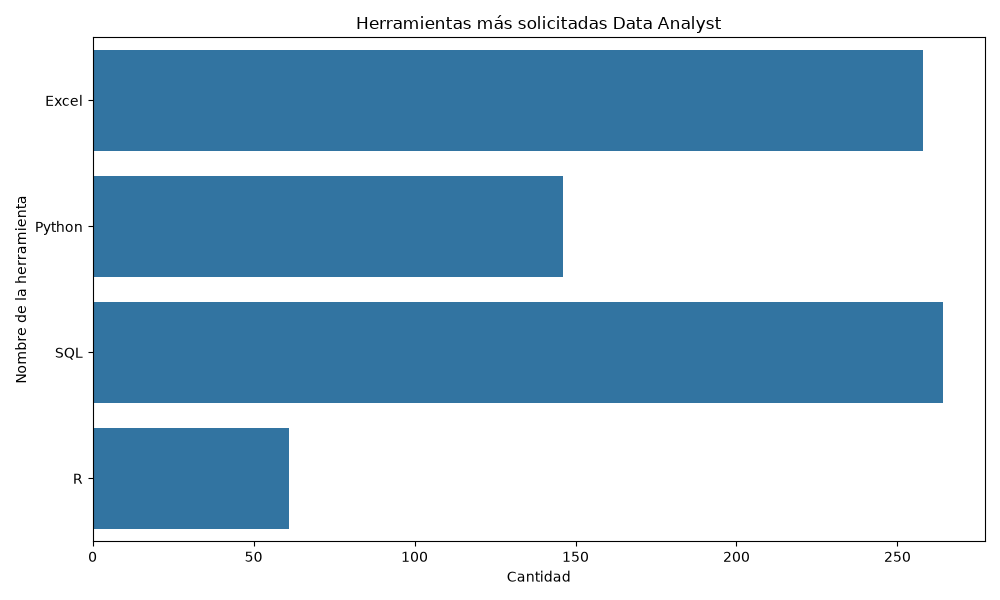
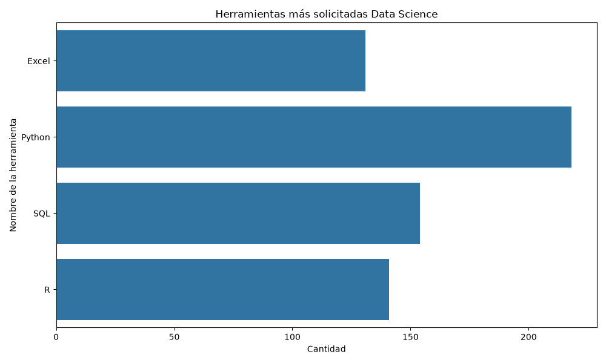
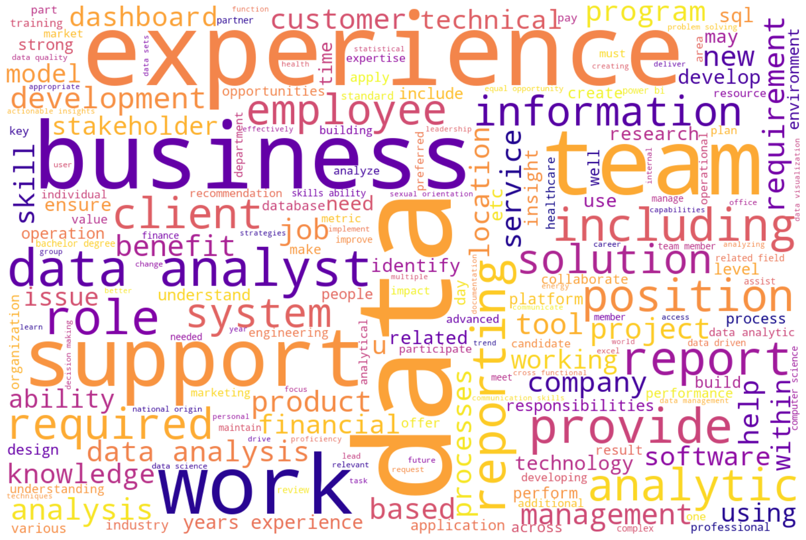
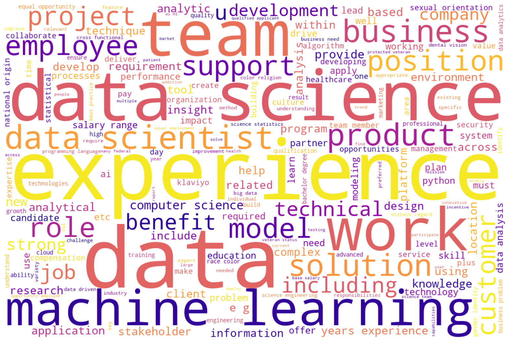
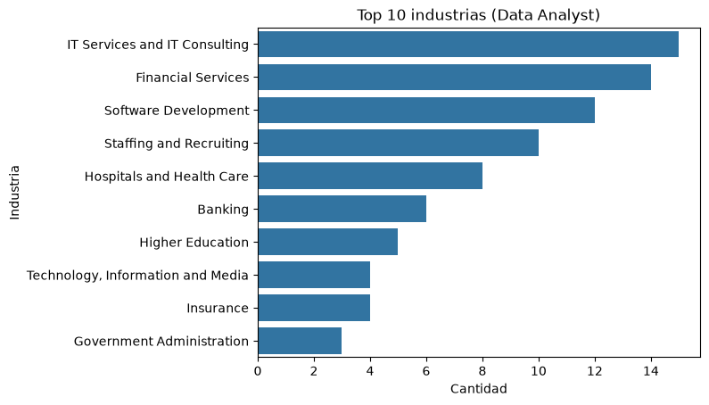
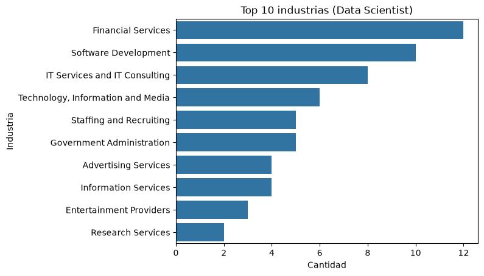

# 📊 LinkedIn Job Postings Analytics (2023 - 2024)

## 📝 Descripción del Proyecto
Este proyecto analiza un conjunto de datos de ofertas de empleo de LinkedIn para identificar cuáles son las habilidades, herramientas y tecnologías más demandadas para el rol de **Data Analyst** como también **Data Scientist**. 

El objetivo principal es transformar descripciones de puestos de trabajo en formato de texto masivo (*unstructured text*) en insights visuales.

## 🚀 Características Clave
- **Limpieza de Datos con Regex:** Procesamiento de texto eliminando caracteres especiales, normalización a minúsculas y estandarización.
- **NLP (Procesamiento de Lenguaje Natural):** Remoción de *stopwords* y tokenización avanzada.
- **Lematización con SpaCy:** Consolidación de palabras complejas a su raíz morfológica en inglés/español utilizando modelos avanzados de NLP (`en_core_web_sm`).

## 📊 Visualizaciones Incluidas
### 1. Skills más frecuentes en los post de Data Analyst
Las  dos Skills más presentes en los posts analizados fueron **Information Tecnology**  y **Analyst** esto era algo que me esperaba, lo que me sorprendio fue al momento de compararla con las skills en los post de **Data Scientist** pues no esperaba que en estos la skill de **Engineering** fuera tan dominante. Esto lo podemos ver en los gráficos siguientes:

### 2. Herramientas más solicitadas (Matplotlib & Seaborn)
Aquí se identifican el volumen de menciones exactas de tecnologías core como SQL, Python, Excel y R mediante límites de palabras exactas. Primero lo analizamos en los post referentes a **Data Analyst**, obteniendo los siguientes resultados mostrados en la gráfica.

Podemos observar que Excel es sin duda la herramineta más pedida, sin embargo para los post de **Data Scientist** tenemos que Python se lleva la corona.

### 2. Nube de Palabras Clave (WordCloud)
Resultado visual de los términos dominantes en los post.
Para **Data Analyst** tenemos que las palabras más presentes son Data, experience, bussines.

De la misma forma para los pots de **Data Scientist** las palabras Data y experience estan presentes y aparece Machine Learning y Team con un numero conciderable de veces.

### 3. Top Industrias
Otro aspecto de interés surge al analizar el tipo de industrias que publican las ofertas de empleo, ya que también se observan diferencias entre los perfiles de **Data Analyst** y **Data Scientist**. En el caso de **Data Analyst**, la industria de servicios y consultoría en tecnologías de la información concentra el mayor número de publicaciones. En contraste, para **Data Scientist**, la industria de servicios financieros es la que ofrece más vacantes en comparación con el resto de los sectores analizados. Estas diferencias pueden apreciarse en los siguientes gráficos.

## 🛠️ Tecnologías Utilizadas
- **Lenguaje:** Python 3.x
- **Manipulación de Datos:** Pandas
- **Visualización:** Matplotlib, Seaborn, WordCloud
- **Procesamiento de Texto (NLP):** NLTK, SpaCy (`en_core_web_sm`)

